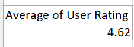
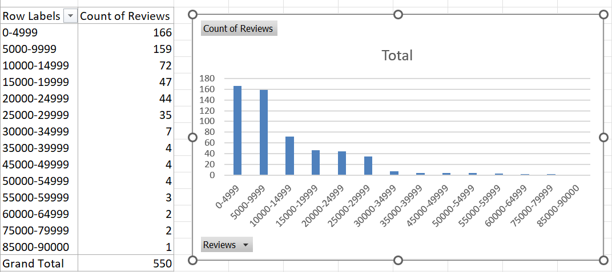
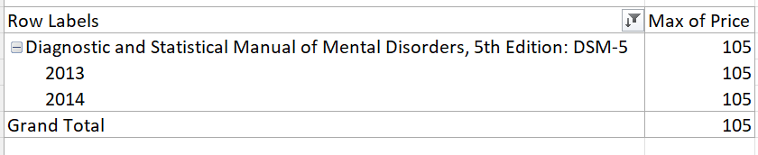
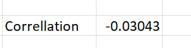
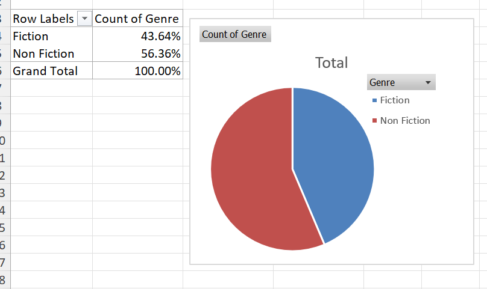

Disclaimer: The dataset is from https://github.com/rohanmistry231/Practice-Datasets-for-Excel

**Questions (first > will be SQL's answer, second > will be Excel's answer):**

•	What is the average rating of the books?
> AVG function for User_rating
> Continuing practicing pivot table. Use avg feature in user rating

•	What is the distribution of the number of reviews received by the books?
> CASE functions. But in the original works, Under 100 is at the bottom, had to use ORDER BY to make it numerical 
> I put Reviews in the Value and Review (count) in row, use group to get the result. Best chart in this case is column

•	Which book has the highest price?
> At first I used only name and max(price), but it only returns 1 result. Hence, I have to use one more filter with WHERE to list all the books with highest price
> I put price in value column and name in row column. I set the price as max. After this I also found out that PivotTable only includes one book title even they have different published year, hence, I added Year in row column

•	What is the correlation between the rating and the price of the books?
> I learnt that there is CORR function? But it's not included in this lmao. Had to use formula! The result is -0.13, which indicates that the price and rating are independent from each other
> I used correl function in excel. Since I want to practice PivotTable, I also used the function with PivotTable with name as row and rating and price as values

•	What is the distribution of the genres of the books?
> First I called the Genre tag, then COUNT(*) total number of them in each tag and calculate percentage. GROUP BY Genre to get the type of Genre
> I put genre in rows and value, convert them into percentage and used pie chart to display them

**Tools:**
1. SQL - SQLite for beginner
2. Excel
3. Github for version control
(Maybe in future, using Python and R)

**Lessons (SQL):**
- REMEMBER TO CREATE TABLE WITH DESIRED PARAMETERS!!!!!!!!!!!!!!
- Ayo no sqr function? only X * X
- Correlation function: (AVG(X*Y) - AVG(X) * AVG(Y)) / ((AVG(X^2) - (AVG(X))^2)(AVG(Y^2) - (AVG(Y))^2)), variable from 1 to -1 
- Some extension may have CORR function instead. 
- I improved a bit by recognizing the pattern and can be flexible to categorize things instead of reading the database for detail

**Lessons (Excel):**
- Correlation function in Excel
